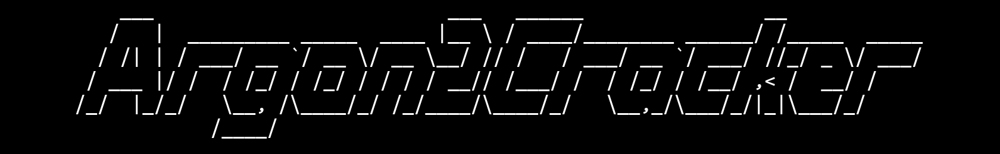
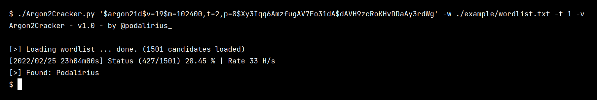

<p align="center">
    A multithreaded bruteforcer of argon2 hashes.
    <br>
    
    <a href="https://twitter.com/intent/follow?screen_name=podalirius_" title="Follow"></a>
    <br>
</p>

## Features

 - [x] Progress updated every second with the number of processed hashes per second.
 - [x] Multithreaded bruteforce.

## Usage

```
$ ./Argon2Cracker.py -h
Argon2Cracker - v1.0 - by @podalirius_

usage: Argon2Cracker.py [-h] [-t THREADS] -w WORDLIST [-v] hash

argon2 hash cracker

positional arguments:
  hash                  argon2 hash

optional arguments:
  -h, --help            show this help message and exit
  -t THREADS, --threads THREADS
                        Number of threads (Default: 16)
  -w WORDLIST, --wordlist WORDLIST
                        Wordlist
  -v, --verbose         Verbose mode. (default: False)

```

## Example

```
./Argon2Cracker.py '$argon2id$v=19$m=102400,t=2,p=8$Xy3Iqq6AmzfugAV7Fo31dA$dAVH9zcRoKHvDDaAy3rdWg' -w ./example/wordlist.txt -v
```



## Contributing

Pull requests are welcome. Feel free to open an issue if you want to add other features.